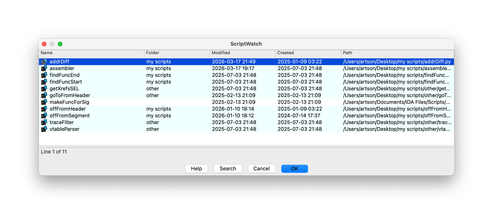

## ScriptWatch

A macOS plugin for IDA Pro that streamlines managing and running Python scripts.

## Overview

ScriptWatch is built for workflows where scripts are frequently added, removed, or reorganized. It keeps your workspace in sync with the filesystem automatically and allows fast, name-based filtering directly from the list, without invoking filter bar (⌘F).

## Features

* **Flexible script management** — Add individual `.py` files or track entire folders
* **Automatic synchronization** — Scripts are added or removed from the list as they change on disk
* **Folder tracking (blue)** — Track all `.py` files in a folder (non-recursive); removing any linked script clears the entire group
* **Visual clarity** — Individually added scripts appear on a white background, while folder-linked scripts are highlighted in light blue
* **Persistent state** — Your script list is saved and restored across IDA sessions
* **Manual refresh** — Reload the list at any time to reflect filesystem changes

## Installation
1. Download latest **ScriptWatch** from the **Releases** page
2. Unzip the downloaded archive
3. Move `scriptwatch` folder into your `$IDAUSR/plugins/` directory
